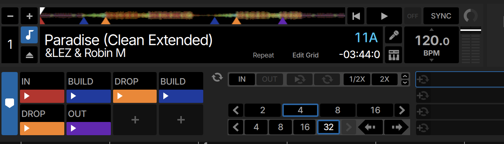

# serato-cue-writer

Analyze a track's waveform and write **colored Serato hot cues directly into the
MP3** (ID3 `GEOB` frames), so they show up in Serato DJ Pro. Built for
house / techno / tech-house, where tracks have a clear intro → build → drop →
breakdown → drop → outro structure.



It places a consistent, beat-accurate cue scheme on every track:

| Slot | Cue     | Position                              | Color    |
|------|---------|---------------------------------------|----------|
| 0    | `IN`    | the very start                        | 🔴 red    |
| 1    | `DROP`  | first drop                            | 🟠 orange |
| 2    | `BUILD` | 32 beats (8 bars) before first drop   | 🔵 blue   |
| 3    | `DROP`  | last drop                             | 🟠 orange |
| 4    | `BUILD` | 32 beats before last drop             | 🔵 blue   |
| 5    | `OUT`   | mixout point (outro thins out)        | 🟣 purple |

Drops are snapped to the **downbeat** using the track's Serato BeatGrid, so cues
land exactly on the grid. It **merges** by default — existing hot cues are never
wiped, new cues only fill free slots.

## Why

Setting the same begin / build / drop / mixout cues by hand on a whole library
is tedious. Serato analyses tracks (BeatGrid, waveform) but doesn't place
structural hot cues for you. This tool does, in bulk, and writes them in
Serato's own binary format so they appear natively.

## How it works

- **Drop detection** keys on the *return of the kick + sub-bass after a trough*
  (the 40–120 Hz band gating low → high and staying high), which is the physical
  signature of a house/techno drop. This is far more reliable than scoring raw
  energy jumps, which get fooled by the rising risers/snares of a build. Tracks
  with no clean breakdown fall back to an energy-jump detector.
- **Beat placement** reads the Serato BeatGrid (exact BPM + first downbeat) and
  snaps drops to the nearest bar, builds to exactly 8 bars before.
- **Mixout** finds the start of the final outro (the last sustained energy
  step-down, referenced to the loud-section level) and places the cue a phrase
  ahead of it for mixing runway (`--mixout-lead-bars`).
- **Writing** edits the `Serato Markers2` frame (authoritative for hot cues in
  modern Serato DJ Pro) and mirrors the first ≤5 cues into the legacy
  `Serato Markers_` frame, exactly like Serato itself. All other Serato frames
  (`BeatGrid`, `Overview`, `Autotags`, `Analysis`, `FLIP`, `LOOP`) are left
  untouched, and re-verified byte-identical after saving.

## Install

Requires Python 3.10+ and `ffmpeg` on the PATH (for librosa to read MP3s).

```bash
python3 -m venv venv
./venv/bin/pip install -r requirements.txt
```

## Usage

Two steps: **analyze** (audio → plan JSON, slow) then **write** (plan → tags, fast).

```bash
# dry-run: analyze + show what would be written, nothing touched
./run.sh /path/to/tracks

# for real (backs up every modified file first)
./run.sh /path/to/tracks --write
```

Or run the steps yourself (useful to review/edit the plan by hand):

```bash
# analyze a folder or a single file
./venv/bin/python analyze.py --input /path/to/tracks

# review the merge table without writing
python3 write_cues.py --plan /path/to/tracks/_cue_plan.json

# write (creates backups/<timestamp>/ first)
python3 write_cues.py --plan /path/to/tracks/_cue_plan.json --write
```

`analyze.py` writes, next to each track:

- `_cue_plan.json` — the plan, with positions in ms (**editable by hand**);
- `<track>.cue_plan.png` — the waveform with planned cues overlaid, to eyeball
  before writing.

Useful flags: `--pre-beats 32` (build distance), `--min-gap 16`,
`--mixout-lead-bars 8` (0 = exactly at the outro), `--limit N`, `--no-png`.

To overwrite an existing cue scheme instead of merging, pass `--replace` to
`write_cues.py` (loops, flips and the track color are kept; backups are made).

### Seeing the cues in Serato

Serato caches cues in its database, so:

1. **Quit Serato** before writing.
2. Reopen Serato and load the tracks (or browse to them in the **Files** panel).
3. If cues don't appear, select the tracks → right-click → **Read Tags /
   Re-scan File Info** to force a re-read of the file tags.

## Safety

- **Dry-run is the default**; you must pass `--write` to change anything.
- Every modified file is copied to `backups/<timestamp>/` before writing.
- The audio stream is never touched — only ID3 tags (verified by audio-stream
  MD5 being unchanged).
- Merge, never wipe: existing hot cues are preserved; re-runs are idempotent
  (a cue already near a planned position is skipped).

## How the Serato format works

Reverse-engineered and verified by round-tripping a real Serato DJ Pro library
of ~1600 MP3s (decode → re-encode → identical cues; the legacy frame even
reproduces byte-for-byte). Credit to Jan Holzhaus's
[`serato-tags`](https://github.com/Holzhaus/serato-tags) and the
[Mixxx Serato metadata notes](https://github.com/mixxxdj/mixxx/wiki/Serato-Metadata-Format)
for the groundwork. See `serato_format.py` for the byte-level layout.

Highlights:

- **`Serato Markers2`** is authoritative for hot cues in modern Serato DJ Pro
  (cues beyond slot 4 live only here). It's `0x01 0x01` + base64 (wrapped at
  72 cols) of a tagged-entry payload. A base64 length of `mod 4 == 1` decodes
  by appending `A==` (a known Serato quirk).
- **`Serato Markers_`** is the legacy ScratchLive frame (raw binary in ID3):
  `0x02 0x05` + count + 22-byte entries (5 cue slots + loop slots) + a
  serato32 track-color footer. Serato mirrors only the first ≤5 hot cues here.
- **Colors** are stored as the Serato "Intro" palette bytes (red `cc0000`,
  orange `cc8800`, blue `0000cc`, purple `8800cc`).
- **`Serato BeatGrid`** is raw binary: `0x01 0x00` + markers; the terminal
  marker carries the BPM, the first marker the anchor downbeat.

## Limitations

Drop detection is a heuristic. On well-structured house/techno tracks it's
accurate; on short radio edits, mashups, or tracks without a clean breakdown it
can mis-place a drop (the *first* drop is the trickiest). The PNG preview and
the hand-editable plan JSON exist for exactly this — eyeball, fix, then write.

## Files

- `serato_format.py` — `Markers2` / `Markers_` / `BeatGrid` codecs + serato32 +
  color palette (stdlib only).
- `detect_drops.py` — librosa-based drop/energy analysis.
- `analyze.py` — audio + BeatGrid → plan JSON (+ validation PNG).
- `write_cues.py` — plan JSON → writes the cues into the files.
- `run.sh` — chains analyze + write.

## License

MIT — see [LICENSE](LICENSE).
